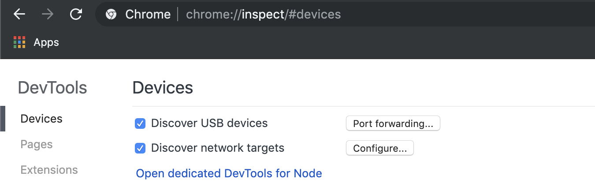
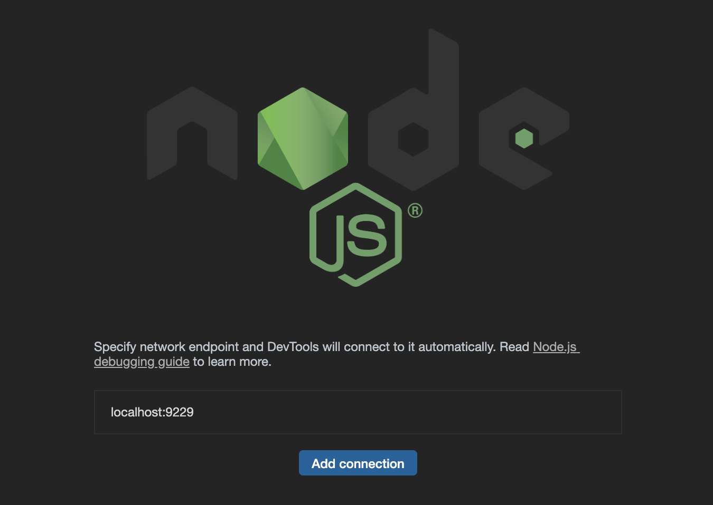

When I was starting my career as a developer, I was under the impression that
most of what developers do is write code. However it quickly dawned on me that a
major part of being a developer is **debugging** the code. Instead of figuring
out how to write code you spend most of your time thinking about why it does not
work.


<a style="background-color:black;color:white;text-decoration:none;padding:4px 6px;font-family:-apple-system, BlinkMacSystemFont, &quot;San Francisco&quot;, &quot;Helvetica Neue&quot;, Helvetica, Ubuntu, Roboto, Noto, &quot;Segoe UI&quot;, Arial, sans-serif;font-size:12px;font-weight:bold;line-height:1.2;display:inline-block;border-radius:3px" href="https://unsplash.com/@hirmin?utm_medium=referral&amp;utm_campaign=photographer-credit&amp;utm_content=creditBadge" target="_blank" rel="noopener noreferrer" title="Download free do whatever you want high-resolution photos from Max Kleinen"><span style="display:inline-block;padding:2px 3px"><svg xmlns="http://www.w3.org/2000/svg" style="height:12px;width:auto;position:relative;vertical-align:middle;top:-2px;fill:white" viewBox="0 0 32 32"><title>unsplash-logo</title><path d="M10 9V0h12v9H10zm12 5h10v18H0V14h10v9h12v-9z"></path></svg></span><span style="display:inline-block;padding:2px 3px">Max
Kleinen</span></a>

This post is part 1 of a 3 part blog post series that goes through the various techniques used in Node.js to debug applications. In this part we will focus on basic debugging and the upcoming parts will be about memory leaks and performance debugging.

Part 1: Debugging Node.js  
Part 2: ...  
Part 3: ...

The process of investigating why code does not work as expected is called debugging.
The origin of the word dates back to when computers were very
different than the current modern ones. They had relays and the first **bug** was an actual moth blocking
a relay. So debugging was the actual process of removing the insect from the
computer.

Because debugging is such an integral part of an developers job, it is important
to familiarize yourself with the tools that you can use to debug your software.
Also debugging effectively requires a certain state of mind and methods. Being
good at debugging is something that every developer should learn and it is a
universal skill that can be applied to any programming language and platform.

## How to debug in Node.js?

I have a background in developing **C#** which is a **statically typed**
compiled language just like for example **Java**. These kind of languages
usually have debugging built-in and have **IDEs** (integrated development
environments) that support debugging out of the box.

**JavaScript** and **Node.js** are different since they don't even usually have
a specific IDE to develop with. Frontend developers utilize browser development
tools to debug and inspect code, but when writing **Node.js** there's not a de facto way to debug your code. There are many ways to do debugging and choosing the right one depends on your use case and what requirements you have.

> 💡 This is an important point: **There is no single best practice when it comes to debugging.**

Depending on the complexity of the issue you are debugging you might need to
either just print out a value from the application or to stop to inspect the
state of the application in more detail. You might also want to debug the
performance and resource utilization of your app instead of going through the
code. These are all possible to do in Node.js and there are some very powerful
tools at your disposal.

## Beyond `console.log`

Simply console logging a bunch of values and hoping to find out why your app is not doing what it's supposed to can be a slow and tedious job. There are times when `console.log` is the right tool for the job, but every now and then you run into an issue that makes you hoping there was a even better way to see what's going on inside your app.

I wont go into details about how to use `console.log` effectively since quite frankly I don't think it is very interesting. Every JavaScript coder knows how to do it and even though there are some neat tricks you can do, it's pretty straight forward stuff.

Instead I'm going to focus on using an actual **debugging client**. Debugging clients typically have features like stepping through code, adding breakpoints, viewing current values and adding watches. With JavaScript you can use debugging clients like **Visual Studio Code** and **Chrome Developer Tools**.

### Gentlemen, start your debuggers!

In frontend development you can simply start the debugging client by opening the developer tools of your favorite web browser. I personally prefer using Chrome but other browsers have decent debugging clients as well. The hotkey to open developer tools is usually `F12` and by selecting the right tab (**Sources** in Chrome) you can start adding breakpoints and watches.

With Node.js you have to first tell the process to listen for a debugging client on a specific port and then attach the client to it. By default debugging is not enabled but you can enable it with the `inspect` option.

```bash
node --inspect .
```

The default port Node.js listens to for debugging client is `9229`. You can also set a different port if you want.

```bash
node --inspect=9228 .
```

### Debug Node.js: Chrome Dev Tools

To use Chrome Developer tools as a debugging client for a Node.js process you should first open the broser and navigate to the URL `chrome://inspect`.



On this page you can also find the **Open dedicated DevTools for Node** link. It opens up in a separate window.



The debugging client automatically connects to the default port 9229 if there is a Node.js listening to it. You can also add your own port numbers.

So now you're ready to do all the basic debugging. Add breakpoints, check values and add watches.

### Debug Node.js: Visual Studio Code

Visual Studio Code is a **code editor** that transcends the capabilities that we normally associate with code editors. It also has a powerful debugging client that can be used to debug a plethora of platforms and languages.

The fastest way to debug a Node.js app is to open a JavaScript file and hit `F5`. If there is no **debug configuration** set, VS Code will attempt to run the file that is open and attach the debugger to it. For small apps this is fine but for a real life Node.js app you need to add a **launch configuration**.

#### Debug mode: launch

You can add a launch configuration by going to the **debug view** and clicking on the **Configure or fix launch.json** button <i style="width: 30px;height: 24px;background-image: url('/cog-icon.png');background-size: 30px 24px;display: inline-block;vertical-align: text-bottom;"></i>. Make sure you have the file you want to run open, eg. app.js, so the configuration knows which file to launch. It will generate the following `launch.json` file:

```json
{
  "version": "0.2.0",
  "configurations": [
    {
      "type": "node",
      "request": "launch",
      "name": "Launch Program",
      "skipFiles": ["<node_internals>/**"],
      "program": "${workspaceFolder}/app.js"
    }
  ]
}
```

The `launch.json` file contains the launch configurations for your **workspace**. The properties we are using in our configuration are:

| Property    | Description                                                                                                                                                                                                                                  |
| ----------- | -------------------------------------------------------------------------------------------------------------------------------------------------------------------------------------------------------------------------------------------- |
| `type`      | The type of our launch configuration is `node`. Visual Studio was clever enough to determine our app is a Node.js app.                                                                                                                       |
| `request`   | Our debug mode is `launch`. Other available debug mode would be `attach`. Launch means that when we start to debug, we also start the app. Attach will attach to a process that is already running. Well go through the `attach` mode later. |
| `name`      | Our launch configuration is named `Launch Program`. This is the name used in the configuration dropdown. If you have multiple launch configurations you should probably name them descriptively                                              |
| `skipFiles` | A list of glob patterns for the debugger to skip when stepping through code. Without this you might end up debugging Node.js or downloaded packages. With the value `<node_internals>/**` all the Node.js internal code is skipped.          |
| `program`   | The file to call when starting debugging. In our app it's `${workspaceFolder}/app.js`. `{workspaceFolder}` is a predefined variable pointing to the root of the workspace.                                                                   |

Now you can still start debugging by hitting `F5` but in the debug view you can also choose starting debug with a specific launch configuration. For now we have just one, but let's next add a new one.

#### Debug mode: attach

Often it is more likely that you already have a Node.js process running on your local machine and listening to the inspect port. In that case you don't want to start another process but to **attach** the debugging client to that process.

You can add a new launch configuration by going to the debug view and opening the **configuration dropdown**. In the dropdown there is an option `Add configuration...`. After clicking on the option choose `Node.js: Attach` as the type of the launch configuration. The following launch configuration is then created:

```json
{
  "type": "node",
  "request": "attach",
  "name": "Attach",
  "port": 9229,
  "skipFiles": [
    "<node_internals>/**"
  ]
},
```

This configuration differs from the one before by `request` being `attach` instead of `launch`. Also instead of `program` it has a property `port` which is the number of the port the process listens to for debugging clients. Just like the default port for Node.js inspect option, the default here is also `9229`.

You can now select the `Attach` configuration from the dropdown and start the debugger. It will attach to the Node.js process as long as it is already started and running.

## More Node.js debugging goodness

You've just finished the first part of a three part series in Node.js debugging!
Look out for more content coming in the following weeks!

Part 1: Debugging Node.js  
Part 2: ...  
Part 3: ...
