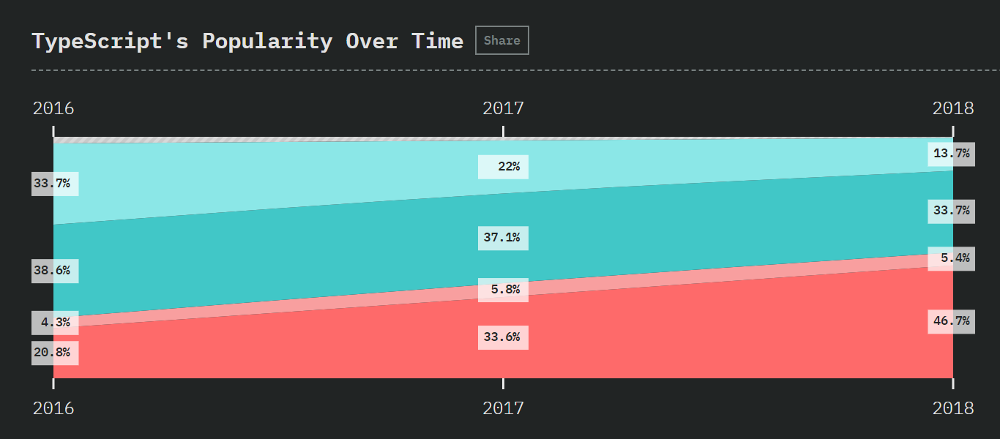
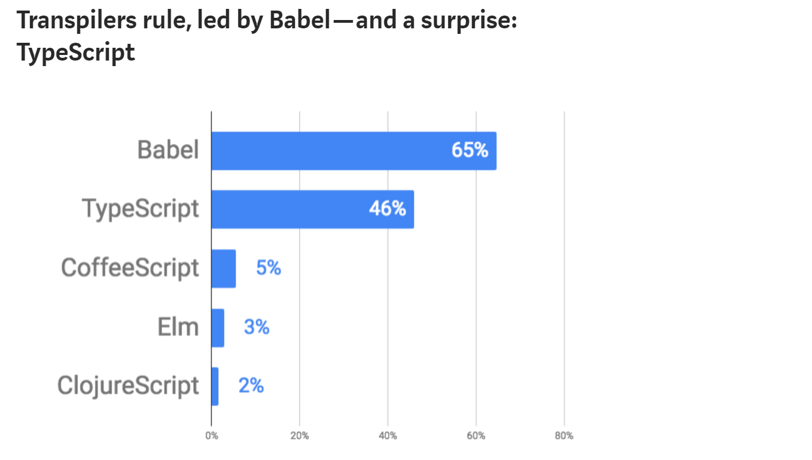

This post is a part of a larger **TypeScript in the Back** series. **TypeScript** is taking the web and **JavaScript** development world by storm and it has some interesting implications on how we do things.

This is the first part of the series.

Part 1: I'd like some Type in my Script instead of Java, please!  
Part 2: 👨‍🔧  
Part 3: 👨‍🔧  
Part 4: 👨‍🔧

In this post, I will try to explain why you should use TypeScript and what it is good for. The later parts will go into more detail about different use cases for TypeScript.

## TypeScript is hotter than ever 🔥

But, just how popular is TypeScript? Is it something that we as web developers or JavaScript developers, in general, should be taking a look at?

The following are just some examples of how insanely popular TypeScript has gotten in a few years.

## The State of ~~Java~~TypeScript

The State of JavaScript is an annual survey which tries to paint a picture of what is happening in the JavaScript ecosystem. Last year's survey showed some expected and some surprising results.

One of the most surprising things about the survey was how popular TypeScript had become.



<em style="display: block; text-align: center;">Screenshot from The state of JavaScript 2018 survey (https://2018.stateofjs.com/javascript-flavors/typescript/)</em>

According to the survey, **46.7 %** of the answerers have used TypeScript and would use it again. Another **33.7 %** have heard of it and would like to learn it. And the numbers are clearly growing each year.

## NPM and the future of ~~Java~~TypeScript

**Laurie Voss** gave a talk at **JSConf US 2018** called **NPM and the future of JavaScript**. He showed some results from a survey they had made in partnership with Node.js foundation and the JS foundation.

A surprise result revealed that while **Babel** was still the most popular JavaScript transpile/compile tool, being used by **65 %** of the npm users, TypeScript was a runner-up, with **46 %** survey respondents reporting they use it.



<em style="display: block; text-align: center;">Screenshot from This year in JavaScript: 2018 in review and npm’s predictions for 2019 (https://medium.com/npm-inc/this-year-in-javascript-2018-in-review-and-npms-predictions-for-2019-3a3d7e5298ef)</em>

## ~~Java~~TypeScript eats the world (or at least Stack Overflow)

So that's two surveys already stating that almost half of the JavaScript developers use TypeScript. I don't know about you, but for me, this was mind-blowing information 🤯.

And it does not end there.

**Stack Overflow** also has an annual developer survey. In the 2019 survey, in the category of all the programming, scripting and markup languages, TypeScript landed on the **tenth place**, just edging out C, Ruby and Go. And if you count only the "actual" programming languages it is on the **seventh place** just behind C++.


<em style="display: block; text-align: center;">Screenshot from Stack Overflow Developer Survey 2019 (https://insights.stackoverflow.com/survey/2019#technology-_-programming-scripting-and-markup-languages)</em>

And in the category of most loved languages TypeScript placed **third** just behind Rust and Python.


<em style="display: block; text-align: center;">Screenshot from Stack Overflow Developer Survey 2019 (https://insights.stackoverflow.com/survey/2019#technology-_-most-loved-dreaded-and-wanted-languages)</em>

## What are types and why do we need them?

So why is TypeScript so popular? What makes it so special that more and more developers are constantly converting to use it instead of just plain old JavaScript?

As the name suggests, the most important thing about TypeScript is **types**. TypeScript is **statically typed** and it has a very powerful **type system**, that allows us to define many different structures in our code.

> The fundamental purpose of a type system is to prevent the occurrence of execution errors during the running of a program
>
> &mdash; <cite>Luca Cardelli, Microsoft Research</cite>

We've all had the unpleasant experience of writing code that looks fine, but then when we run the program and load a page or click a button you get an error.

These **runtime errors** can be extremely difficult to debug and fix. The most notorious of them all being the illusive **null pointer exceptions**.

All languages have some kind of type system. Some are weaker than others, some are type checked at runtime instead of compile time, but they still are there, under the covers.

## Static typing (TypeScript) vs Dynamic Typing (JavaScript)

JavaScript is a **dynamic language** with **dynamic type checking**, which means that for example, variables get types assigned to them while the code is running and the types can also change during the program execution.

### Basic type checking

Take a look at the following example:

```javascript
let foo = 'bar'
typeof foo // results in 'string'
foo = 1
typeof foo // results in 'number'
```

The type of the variable **foo** depends on the value assigned to it. First, it has the value **'bar'** which is a string, so the type of the variable is also **string**. Next, we assign **1** to the variable and that also changes the type of the variable to **number**.

In TypeScript we would get a compiler error from the second assignment:

```typescript
let foo = 'bar'
foo = 1 // ERROR: Type '1' is not assignable to type 'string'.
```

This is because TypeScript is a **static language** with **static type checking**. Instead of assigning types at runtime they are assigned at compile time. This means that typing errors also occur before even running the code.

But why can't the compiler first assign a string type to the variable and later allow changing it to a number?

To understand this we should talk about **type inference**. Without type inference in static languages, the types must be explicitly assigned. This would mean writing the first line of declaration and assignment as:

```typescript
let foo: string = 'bar'
```

This is effectively the exact same line as before. The type is just explicitly assigned. Type inference is just a way to decrease the number of type annotations needed.

But when we write the type explicitly the problem with changing the type becomes more apparent. We are saying that the variable is a string and then we assign a value that is not a string to it. This is clearly an error.

In most static languages this would be the end of the story, but TypeScript is not just any static language. It has a very powerful type system that allows something called **union types**. If we wanted to be able to first assign a string to a variable and after that a number we could do the following:

```typescript
let foo: string | number = 'bar'
foo = 1
```

A union type allows defining a type that can be one of the listed types. The type is still strong since it only allows strings or numbers. If you try to assign for example a boolean to the variable you will get a compiler error.

### Functions and types

There are even more important distinctions between static and dynamic languages. Functions in dynamic languages can cause all kinds of surprises, which can result in surprising and hard to understand errors.

In a dynamic language, a function can be called with any arguments. Take a look at this example:

```javascript
function f(a, b) {
  return a + b
}

f(1, 2) // results in 3
f(1) // results in NaN
f() // results in NaN
f(1, 2, 3) // results in 3
f('a', 'b') // results in 'ab'
f(1, 'a') // results in '1a'
```

Notice how calling the f function with two parameters gives the result we expected. But calling it with any other number of parameters is also acceptable. Even calling it with string parameters instead of numbers does not throw an error. And the strings work surprisingly well since the `+` operator works on both numbers and strings.

In TypeScript the same function calls would act as follows:

```typescript
function f(a, b) {
  return a + b
}

f(1, 2) // results in 3
f(1) // ERROR: Expected 2 arguments, but got 1.
f() // ERROR: Expected 2 arguments, but got 0.
f(1, 2, 3) // ERROR: Expected 2 arguments, but got 3.
f('a', 'b') // results in 'ab'
f(1, 'a') // results in '1a'
```

Now if we call the function with any other amount of parameters than two, the compiler will give us an error. However, calling the function with string parameters instead of numbers is still acceptable.

This is because the function f has no type annotations and it is trying to do type inference to know the types of its parameters. The only clue is the `+` operator, but since JavaScript also does **type conversion** automatically, it is impossible to know what the types of the **a** and **b** parameters are. Hence the type of the function is `function f(a: any, b: any): any`.

**any** is a special type in TypeScript that means the type of the value can be anything. The way the function is written causes TypeScript to **implicitly** type all parameters and return value as any.

But what if we did not like the fact that the function can take parameters of any type? And maybe even more importantly we don't want it to return an any type. We want the function to take two numbers and return a number. This can easily be done by adding type annotations:

```typescript
function f(a: number, b: number): number {
  return a + b
}

f(1, 2) // results in 3
f(1) // ERROR: Expected 2 arguments, but got 1.
f() // ERROR: Expected 2 arguments, but got 0.
f(1, 2, 3) // ERROR: Expected 2 arguments, but got 3.
f('a', 'b') // ERROR: Argument of type '"a"' is not assignable to parameter of type 'number'
f(1, 'a') // ERROR: Argument of type '"a"' is not assignable to parameter of type 'number'
```

As you can see, adding the type annotations gives us two more compiler errors and now the only acceptable way to call the function is the first call where we have to parameters with the number type.

One thing to notice about **type inference** is that you don't actually have to explicitly set the return type as a number. TypeScript can infer that since the return value is the sum of the two parameters that are both numbers, the result must also be a number. However, it is a matter of taste whether you want to infer the return value or set it explicitly to make it more clear.

I think using types with functions is one of the greatest things about TypeScript. When refactoring function parameters, we can easily spot where we are still calling the function with wrong arguments. And with union types and **generics** you can still have functions that work with different types, you just have to be much more explicit about what types are accepted.

TypeScript allows us to define boundaries, which we know we won't be breaking. You get the most out of it by not allowing at least implicit any types (there is a compiler option `noImplicitAny` for this) and very sparingly explicitly type anything as any.

## The tools are what makes a language

It's not just the avoiding errors part about types that makes them worth your while.

One of the greatest things about types is that you can know more about the code that you are about to write. This means that you can have an IDE or code editor that can tell you what you can do next, and give suggestions about what you probably want to do next.

The best TypeScript experience, in my opinion, is in **Visual Studio Code**. It integrates very well with the **TypeScript language service** and uses the typings to give a very auto-completion feature with inline documentation (the feature is called **IntelliSense**).


The amazing thing about IntelliSense is that it even works with regular JavaScript. Visual Studio Code uses the same TypeScript language service for both TypeScript **and** JavaScript. It allows you to take advantage of TypeScript features even if you are not using it!

## I hate types / I love types! 😎

Personally, I've had mixed emotions about TypeScript. I've been a **C#** developer for more than ten years, so the idea of static typing is far from new to me.

When I started writing more and more JavaScript, one of the most compelling features about it was the absence of type annotations. In type systems like C# and **Java**, types are everywhere and the annotations can be very verbose. Sometimes it feels like you are spending more time giving types to things than writing the actual code that does something.

However, TypeScript has a very modern type system compared to these more classic static languages. It has very good type inference so it requires fewer annotations. And having static typing does not mean that it is **object-oriented** at all. TypeScript is a **multi-paradigm** language just like JavaScript and because the type system is so powerful it reminds me a lot about some of the static functional programming languages like **F#**.

There is still one downside to using TypeScript, and that is the need to have a compile step to get the code running. Since TypeScript does not run natively in a browser (only JavaScript does that), you will always have to compile it down to JavaScript first. While this makes perfect sense in a static language, it does make the developer experience a little more complicated from plain old JavaScript. But the thing is that modern JavaScript gets compiled or transpiled anyhow, so having a compiler is something that is really hard to avoid anyway.

One other thing that you still run into with TypeScript is missing or incomplete typings for a library. It is really frustrating to try to fix the typings for external libraries. Luckily this is something that is getting less common all the time since TypeScript is getting so popular. There are also libraries that are doing so complex dynamic typing that they are extremely hard to type statically. But since the type system in TypeScript is already powerful and constantly improving, it is likely that even the most complex libraries with have full type support later on.

## Summary and to be continued...

I'd be lying if I said I always believed in TypeScript or always knew that it would be so popular one day. But the recent surge in popularity has given me a reason to give it another try. So far it has been great. I can strongly recommend everyone at least trying it out. Maybe you don't need to use it for all of your applications but the ones with a larger team of developers and a longer life-span are a good fit for TypeScript.

This was the first part of a four-part blog post series that I'm working on. The rest of the series will focus on how to use TypeScript in backend development.

### TypeScript in the back series

Part 1: I'd like some Type in my Script instead of Java, please!  
Part 2: 👨‍🔧  
Part 3: 👨‍🔧  
Part 4: 👨‍🔧
