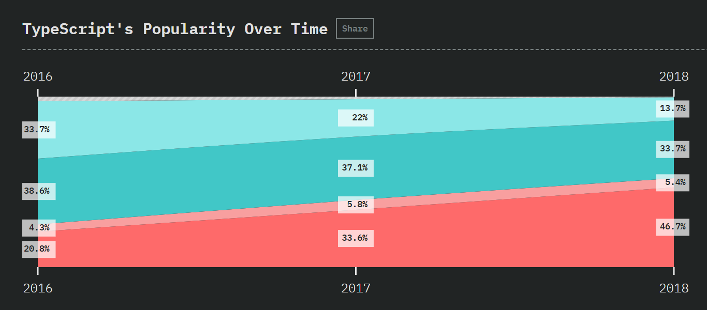
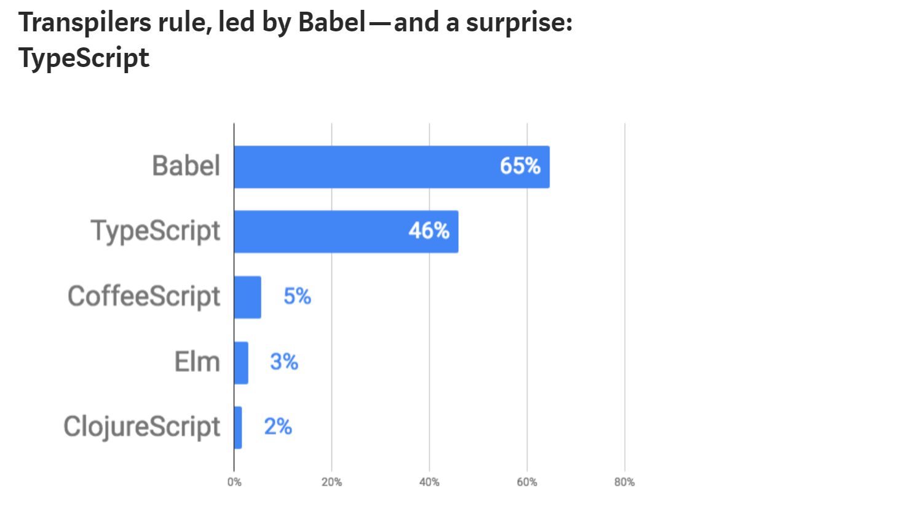
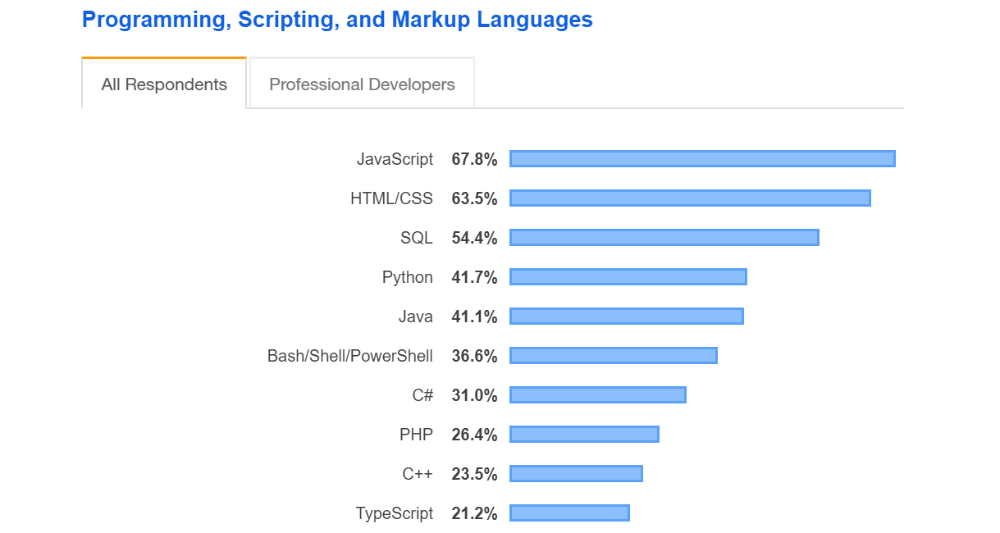
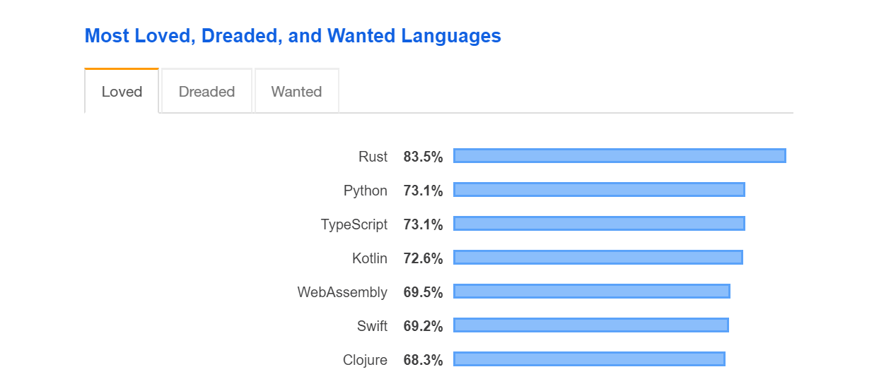

The State of JavaScript is an annual survey which tries to paint a picture of what is happening in the JavaScript ecosystem. Last year's survey showed some expected and some surprising results.

One of the most surprising things about the survey was how popular TypeScript had become.

<em style="display: block; text-align: center;">Screenshot from The state of JavaScript 2018 survey (https://2018.stateofjs.com/javascript-flavors/typescript/)</em>

According to the survey **46.7 %** of the answerers have used TypeScript and would use it again. Another 33.7 % have heard of it and would like to learn it. And the numbers are clearly growing each year. It seems like TypeScript is insanely popular.

Then there was the talk by **Laurie Voss** at **JSConf US 2018** called **NPM and the future of JavaScript**. He showed some results from a survey they had made in partnership with Node.js foundation and the JS foundation. A surprise result revealed that while Babel was still the most popular JavaScript transpile/compile tool, being used by 65 % of the npm users, TypeScript was a runner-up, with **46 %** survey respondents reporting they use it.

<em style="display: block; text-align: center;">Screenshot from This year in JavaScript: 2018 in review and npm’s predictions for 2019 (https://medium.com/npm-inc/this-year-in-javascript-2018-in-review-and-npms-predictions-for-2019-3a3d7e5298ef)</em>

So that's two surveys already stating that almost half of the JavaScript developers use TypeScript. I don't know about you but for me this mind blowing information 🤯.

And it does not end there.

Stack Overflow also has an annual developer survey. In the 2019 survey, in the category of all the programming, scripting and markup languages, TypeScript landed on the tenth place, just edging out C, Ruby and Go. And if you count only the "actual" programming languages it is on the seventh place just behind C++.

<em style="display: block; text-align: center;">Screenshot from Stack Overflow Developer Survey 2019 (https://insights.stackoverflow.com/survey/2019#technology-_-programming-scripting-and-markup-languages)</em>

And in the category of most loved languages TypeScript placed third just behind Rust and Python.

<em style="display: block; text-align: center;">Screenshot from Stack Overflow Developer Survey 2019 (https://insights.stackoverflow.com/survey/2019#technology-_-most-loved-dreaded-and-wanted-languages)</em>

## Types are cool! 😎

I'm sure I could find even more surveys that would prove the same point. **TypeScript is getting really popular!**

Of course being popular and even being loved does not necessarily mean that something is a good tool or a programming language. But talking to people and reading opinions on Twitter, Reddit and blogs, It seems like there is an overwhelming common opinion that TypeScript is awesome.

Even to a little comical extent, for it seems like developers (mostly frontend) who haven't really programmed in a statically typed language before are going crazy about how much types make everything easier 🙂. As a developer with a long background in C# (a statically typed language), I can't help but to chuckle sometimes when listening to these **new** revelations about typing.

I have to admit, I was surprised by these results since I've been coding C# for over a ten years now and having types is something I've always been used to. When I started to write more JavaScript it felt refreshing to not have to annotate types everywhere. It felt faster and in a way the code event felt more clean.

But I also kept using TypeScript for most projects in my work and I've had a love-hate relationship with it. Sometimes having TypeScript is awesome (for example when doing non-trivial refactoring) and sometimes TypeScript feels like it's making things harder (for example with Redux, Redux Saga or Styled Components).
